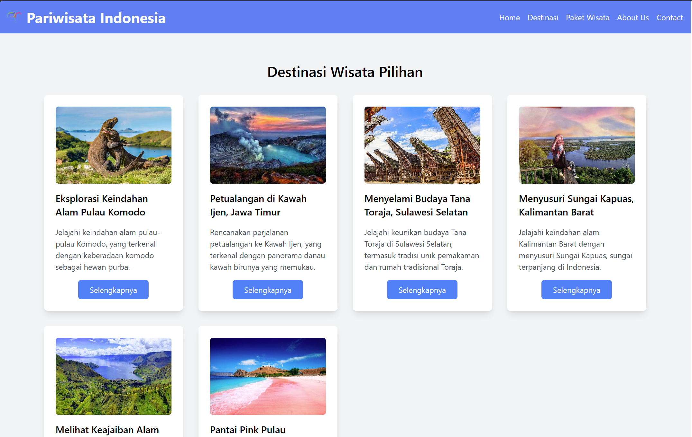
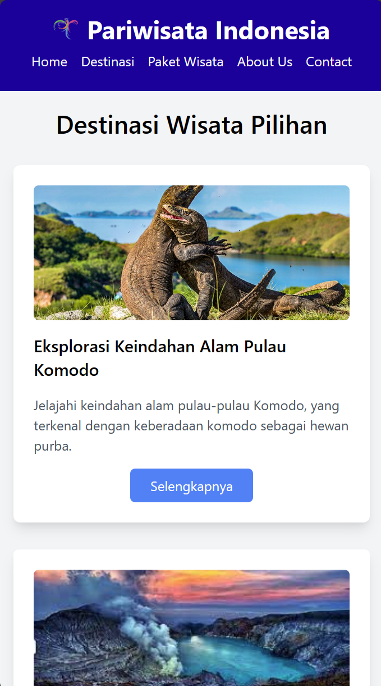

# Landing Page Website Pariwisata

## Penjelasan Ringkas Program
Repositori ini berisi implementasi program untuk halaman website pariwisata yang telah dibangun dengan menggunakan HTML dan CSS. Halaman tersebut dirancang dengan berbagai komponen utama, seperti header, navigasi, deskripsi destinasi wisata, galeri foto, dan footer. Halaman ini responsif dan secara otomatis menyesuaikan tampilannya saat diakses melalui perangkat mobile. 

## Cara Menjalankan Program
1. Clone repository ini :
   ``` git clone https://github.com/munzayanahusn/tourism-htmlcss.git ```
2. Buka `index.html` pada folder `src` pada browser Anda

## Tampilan Halaman

### Desktop Mode


### Mobile Mode


## Kontributor
Husnia Munzayana
